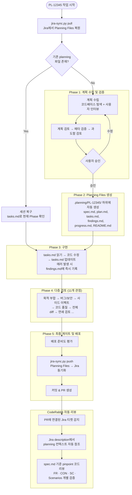

# File-based Planning Workflow

파일 시스템을 AI 에이전트의 영구 메모리로 활용하고, 검토 주도 개발(Review-Driven Development)로 품질을 보장하는 워크플로우입니다.

## 소개

### 이 워크플로우란?

AI 에이전트와 협업할 때 발생하는 고질적인 문제들을 해결하기 위한 파일 기반 작업 관리 방식입니다.

> 이 워크플로우는 [ahastudio/file-based-planning-workflow](https://github.com/ahastudio/file-based-planning-workflow)를 참고하여 만들었습니다.

### 해결하는 문제

| 문제 | 해결 방법 |
|------|-----------|
| 컨텍스트 리셋 시 작업 내용을 잊어버림 | planning 파일을 영구 메모리로 활용 |
| 긴 작업 중 원래 목표를 잃어버림 | tasks.md를 북극성으로 매 작업 전 재독 |
| 같은 실수를 반복함 | 모든 에러를 findings.md에 기록하여 추적 |
| 스펙 없이 구현하면 스코프가 발산함 | spec.md로 FR·CON·SC·시나리오를 사전 확정 |
| 구현의 적절성을 스스로 판단 못함 | 계획 4단계 검토 후 구현 진행 |
| "전반적으로 검토해줘"가 효과 없음 | 11개 관점으로 분리된 다층 검토 |
| 코드리뷰가 스펙을 모르고 피상적임 | CodeRabbit이 Jira의 spec.md를 참조하여 핀포인트 리뷰 |
| "이 코드 왜 이렇게 짰지?" 맥락이 없음 | findings.md에 의사결정 근거와 시행착오 기록 |
| 담당자 변경 시 인수인계가 안 됨 | planning 파일 자체가 인수인계 문서 역할 |

### 핵심 철학: 계획 4단계 + 구현 1단계 + 검토 11단계

```
Phase 1: 계획 수립 및 검증 (4단계) ─── 계획을 세우고, 세 번 검토한다
Phase 2: Planning Files 생성       ─── 영구 메모리를 준비한다
Phase 3: 구현 (1단계)             ─── 구현은 단 한 단계다
Phase 4: 다층 검토 (11단계)       ─── 11개 관점으로 검토한다
Phase 5: 최종 게이트 및 배포       ─── 배포 수준인지 최종 확인한다
```

에이전트에게 구현은 쉽고, **올바른 구현**이 어렵습니다. 이 비율이 이 워크플로우의 철학입니다.

---

## 이점

### 1. AI 컨텍스트 소실 방지
AI 에이전트의 컨텍스트가 리셋되어도 planning 파일이 영구 메모리 역할을 합니다. `tasks.md`를 읽으면 현재 Phase와 목표를 즉시 복구하고, `findings.md`에서 이전 결정과 실패 이력을 확인하여 같은 실수를 반복하지 않습니다.

### 2. 사전 스펙 정의로 방향성 확보
구현 전에 `spec.md`로 요구사항(FR), 제약조건(CON), 성공 기준(SC), 시나리오(Given-When-Then)를 확정합니다. 에이전트가 구현 도중 방향을 잃거나 스코프를 벗어나는 것을 방지하고, 구현 완료 후 스펙 대비 검증이 가능해집니다.

### 3. 코드 고고학
"이 코드는 왜 이렇게 작성되었는가?"에 대한 답이 planning 파일에 남아 있습니다. `findings.md`의 Technical Decisions에는 각 결정의 근거가, Issues Encountered에는 시도와 실패 이력이 기록됩니다. 6개월 후 코드를 다시 볼 때 의사결정 맥락을 복원할 수 있습니다.

### 4. CodeRabbit 핀포인트 리뷰
Jira 티켓에 동기화된 planning 컨텍스트를 CodeRabbit이 자동으로 참조하여, "전반적으로 잘 됐습니다" 대신 `spec.md`의 FR·CON·SC·시나리오를 개별 검증하는 코드리뷰를 수행합니다. 위반 테스트에서 7/7 (100%) 탐지율을 확인했습니다.

### 5. 인수인계 없는 작업 연속성
planning 파일 자체가 인수인계 문서입니다. 다른 사람(또는 다른 AI 에이전트)이 `tasks.md`를 읽으면 현재 진행 상황을, `progress.md`를 읽으면 지금까지의 작업 내역을, `spec.md`를 읽으면 목표를 파악할 수 있습니다. 별도의 인수인계 미팅이나 문서 작성 없이 작업을 이어받을 수 있습니다.

---

## 빠른 시작

AI 에이전트에게 다음과 같이 말하면 됩니다:

```
PL-12345 작업 시작
```

에이전트가 `AGENTS.md`를 읽고 자동으로 워크플로우를 실행합니다.

1. Jira 티켓(`PL-12345`) 존재 여부를 확인합니다
2. 계획 인터뷰를 진행하고 사용자 승인을 받습니다
3. `.planning/PL-12345/` 하위에 planning 파일을 자동 생성합니다
4. Phase 3(구현) ~ Phase 5(배포)를 순서대로 진행합니다

**추가 설정 없이 바로 시작할 수 있습니다.**

---

## 파일 구조

```
AGENTS.md                          ← 공통 워크플로우 (Single Source of Truth)
CLAUDE.md  → AGENTS.md (symlink)   ← Claude Code 자동 로딩
GEMINI.md  → AGENTS.md (symlink)   ← Gemini CLI 자동 로딩
templates/                         ← planning 파일 템플릿
  spec.md
  plan.md
  tasks.md
  findings.md
  progress.md
scripts/                           ← 자동화 스크립트
  jira-sync.py                     ← Jira 티켓 양방향 동기화
.planning/                         ← 작업별 planning 파일 (자동 생성)
  {티켓번호}/{하위디렉토리}/
    spec.md        ← 요구사항 명세
    plan.md        ← 구현 계획
    tasks.md       ← 작업 추적 (북극성)
    findings.md    ← 기술적 발견사항 및 결정
    progress.md    ← 세션별 작업 내역
    README.md      ← 기능 설명
```

---

## 에이전트별 설정

### Claude Code

`CLAUDE.md`가 `AGENTS.md`의 symlink로 설정되어 있어 Claude Code 실행 시 자동으로 로딩됩니다.

```bash
# symlink 확인
ls -la CLAUDE.md
# CLAUDE.md -> AGENTS.md
```

추가 설정이 필요하지 않습니다.

### OpenAI Codex

Codex는 `AGENTS.md`를 직접 자동으로 로딩합니다.

추가 설정이 필요하지 않습니다.

### Google Gemini CLI

`GEMINI.md`가 `AGENTS.md`의 symlink로 설정되어 있어 Gemini CLI 실행 시 자동으로 로딩됩니다.

```bash
# symlink 확인
ls -la GEMINI.md
# GEMINI.md -> AGENTS.md
```

추가 설정이 필요하지 않습니다.

### Windows 사용자 참고

Windows는 symlink를 기본적으로 지원하지 않을 수 있습니다. 이 경우 `AGENTS.md`를 수동으로 복사하여 사용하세요.

```cmd
copy AGENTS.md CLAUDE.md
copy AGENTS.md GEMINI.md
```

단, 이후 `AGENTS.md`가 변경되면 복사 파일도 수동으로 갱신해야 합니다.

---

## 워크플로우 요약

상세 내용은 [AGENTS.md](AGENTS.md)를 참조하세요.



| Phase | 단계명 | 설명 |
|-------|--------|------|
| Phase 1 | 계획 수립 및 검증 | 계획 수립 → 계획 검토 → 메타 검증 → 과도함 검토 |
| Phase 2 | Planning Files 생성 | spec.md, plan.md, tasks.md, findings.md, progress.md, README.md 자동 생성 |
| Phase 3 | 구현 | 파일 수정, 에러 기록, 테스트 작성 및 실행 |
| Phase 4 | 다층 검토 | 11개 관점(목적 부합, 보안, 사이드 이펙트 등)으로 순차 검토 |
| Phase 5 | 최종 게이트 및 배포 | 배포 준비도 평가, Jira push, 커밋, PR 작성 → CodeRabbit 자동 리뷰 |

---

## 프롬프트 컨벤션

| 프롬프트 | 동작 |
|----------|------|
| `{티켓번호} 작업 시작` | 새 작업 시작 (워크플로우 전체 흐름 실행) |
| `{티켓번호} 이어서` | 세션 복구 (중단된 Phase부터 재개) |
| `{티켓번호} Phase {N} 재개` | 특정 Phase부터 재개 |
| `{티켓번호} 검토 시작` | Phase 4(다층 검토) 시작 |
| `{티켓번호} 현황` | 현재 진행 상태 확인 |

**예시:**

```
PL-12345 작업 시작      # 처음 시작할 때
PL-12345 이어서         # 다음 날 이어서 작업할 때
PL-12345 Phase 4 재개   # 검토 단계부터 다시 시작할 때
```

---

## Jira 티켓 연동

> **에이전트는 Jira에 직접 접근하지 않습니다.** 반드시 `scripts/jira-sync.py` 스크립트를 통해 통신합니다.

### 사전 설정

```bash
# 1. 의존성 설치
pip3 install -r scripts/requirements.txt

# 2. 대화형 설정 (권장 - .env 파일에 자동 저장)
python3 scripts/jira-sync.py setup

# 또는 직접 환경 변수 설정
export JIRA_BASE_URL="https://your-domain.atlassian.net"
export JIRA_EMAIL="your-email@company.com"
export JIRA_API_TOKEN="your-api-token"
```

**API 토큰 발급:** https://id.atlassian.com/manage/api-tokens 에서 API 토큰 발급 (스코프 없는 클래식 토큰 권장). 스코프 토큰 사용 시 `.env`에 `JIRA_AUTH_METHOD=bearer`를 추가하세요.

스크립트는 `JIRA_BASE_URL`에서 cloudId를 자동 취득하여 API Gateway(`api.atlassian.com`)를 사용합니다.

> 환경 변수가 없으면 pull/push 실행 시 대화형으로 값을 입력받고 `.env` 파일에 저장합니다. `.env`는 `.gitignore`에 포함되어 있어 저장소에 커밋되지 않습니다.

### 작업 시작 시 (Pull)

```bash
python3 scripts/jira-sync.py pull PL-12345
python3 scripts/jira-sync.py pull PL-12345 --force  # 충돌 무시하고 강제 pull
```

Jira description의 `PLANNING_START`~`PLANNING_END` 영역을 파싱하여 로컬 `.planning/{티켓번호}/` 디렉토리에 파일로 복원합니다. 각 파일별로 타임스탬프를 비교하여 로컬이 더 최신이면 스킵합니다. 티켓이 없으면 경고 후 중단합니다.

### 커밋 전 (Push)

```bash
python3 scripts/jira-sync.py push PL-12345
python3 scripts/jira-sync.py push PL-12345 --force  # 충돌 무시하고 강제 push
```

로컬 planning 파일을 Jira description에 동기화합니다. 각 파일별로 타임스탬프를 비교하여 Jira가 더 최신이면 스킵합니다. 기존 description은 보존되며, planning 영역만 멱등성 있게 갱신됩니다.

이 방식으로 팀원 누구나 Jira 티켓에서 planning 컨텍스트를 확인할 수 있고, 다른 환경에서 작업을 이어받을 수 있습니다.

---

## 다른 프로젝트에 적용하기

이 워크플로우를 다른 레포지토리에 적용하려면 아래 파일들을 복사하세요.

### 필수 파일

```
AGENTS.md                    ← 공통 워크플로우 (SSoT)
templates/
  spec.md                   ← 요구사항 명세 템플릿
  plan.md                   ← 구현 계획 템플릿
  tasks.md                  ← 작업 추적 템플릿
  findings.md               ← 발견사항 템플릿
  progress.md               ← 작업 내역 템플릿
```

### 선택 파일 (Jira 연동 시)

```
scripts/
  jira-sync.py              ← Jira 양방향 동기화
  requirements.txt          ← Python 의존성 (requests)
```

### 적용 순서

```bash
# 1. 파일 복사 후 symlink 생성
ln -sf AGENTS.md CLAUDE.md
ln -sf AGENTS.md GEMINI.md

# 2. .gitignore에 추가
echo ".planning/" >> .gitignore
echo ".env" >> .gitignore

# 3. (선택) Jira 연동 설정
pip3 install -r scripts/requirements.txt
python3 scripts/jira-sync.py setup
```

### 옮기지 않아도 되는 것들

| 파일 | 이유 |
|------|------|
| `.planning/` | 프로젝트별 planning 데이터 (자동 생성) |
| `README.md` | 이 워크플로우 레포 자체의 설명서 |
| `records/` | 과거 이력 |
| `scripts/test_jira_sync.py` | 스크립트 테스트 코드 |
| 참고 문서 (`*-development.md` 등) | 방법론 심화 문서 |

복사 후 AI 에이전트에게 `{티켓번호} 작업 시작`이라고 말하면 바로 사용할 수 있습니다.

---

## 참고 문서

- [AGENTS.md](AGENTS.md) - 공통 워크플로우 상세 (에이전트가 읽는 SSoT)
- [spec-driven-development.md](spec-driven-development.md) - Spec 주도 개발 방법론
- [file-based-workflow.md](file-based-workflow.md) - 파일 기반 워크플로우 심화
- [planning-with-files.md](planning-with-files.md) - Planning 파일 활용 가이드
- [templates/](templates/) - planning 파일 템플릿 모음
